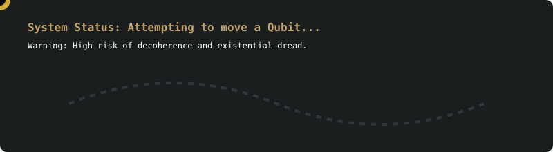
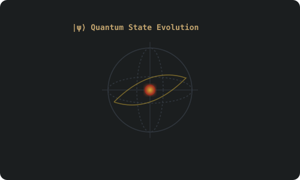

⋆────────────────⃝─⃝⃝⃝⃝────────────────────────────────⋆

˚　　　　✦　　　.　　. 🪐　 ˚　.　　　　 　　.　　　　　　 ✦　　　.　　˚　🌒　　　　. ✦ 　🌍
　　.  　 　　　˚　　　　　*　　 　　✦　　　.　　.　　　✦　　˚ 　　　 　　˚　.　*　　. 　˚　　.

### |State Evolution And Reality Checks⟩

Inspired by the timeless geometry of the Nazca Lines, **QPerú** is the Peruvian aspiring chapter of the global QWorld network, dedicated to advancing quantum education, research, and community development throughout Peru.

Founded by Peruvian students, researchers, educators, engineers, and technology enthusiasts, QPerú seeks to build an open, collaborative, and inclusive quantum ecosystem where anyone: from curious beginners to experienced researchers, can learn, contribute, and innovate.

Just as the Nazca civilization created extraordinary geometric patterns that continue to inspire the world centuries later, QPerú believes that ᴛᴏᴅᴀʏ'ꜱ ᴋɴᴏᴡʟᴇᴅɢᴇ ᴄᴀɴ ʙᴇᴄᴏᴍᴇ ᴛᴏᴍᴏʀʀᴏᴡ'ꜱ ᴛᴇᴄʜɴᴏʟᴏɢɪᴄᴀʟ ʟᴇɢᴀᴄʏ.

⋆────────────────⃝─⃝⃝⃝⃝────────────────────────────────⋆

### ོ༘₊⁺☀︎₊⁺⋆.˚ Our Mission & Vision ☀︎₊⁺⋆.˚

<table align="center" width="100%">
  <tr>
    <td width="50%" align="center" style="background-color: #1b1e1f; border-radius: 12px; padding: 20px; border: 1px solid #30363d;">
      <h3>Our Mission</h3>
      
To democratize quantum technologies across Peru by making high-quality education freely accessible while fostering collaboration between academia, industry, government, and the international quantum community; Aligned with QWorld's principles.

    </td>
    <td width="50%" align="center" style="background-color: #1b1e1f; border-radius: 12px; padding: 20px; border: 1px solid #30363d;">
      <h3>Our Vision</h3>
      
We envision a future where Peru becomes one of Latin America's leading centers for quantum technologies through education, research, innovation, and international collaboration.

    </td>
  </tr>
</table>

We aim to position Peru as an active contributor to the global quantum ecosystem by connecting local talent with worldwide opportunities in quantum computing, quantum information science, quantum communication, quantum optimization, quantum artificial intelligence, and quantum cybersecurity.

⋆────────────────⃝─⃝⃝⃝⃝────────────────────────────────⋆

### ⋆. ⌬ ˚ What we do: ⚛ 🧪 𒉭 ⋆

QPerú organizes and drives:

* **Workshops & Training:** QBronze, QNickel, QSilver, specialized QWorld workshops, and certification-oriented training.
* **Hands-on Learning:** Practical laboratories, quantum programming bootcamps, and study circles.
* **Community & Research:** Quantum hackathons, QTalks, invited lectures, reading groups, research mentoring, and outreach activities for schools.

⋆────────────────⃝─⃝⃝⃝⃝────────────────────────────────⋆

### ✈︎ Collaboration Network 🗺

QPerú believes that quantum technologies can only flourish through deep institutional collaboration across three core pillars:

<b>˙˖°🎓 ༘⋆ Universities & Academic Institutions</b>

* Universidad Nacional Mayor de San Marcos (UNMSM)
* Pontificia Universidad Católica del Perú (PUCP)
* Universidad de Ingeniería y Tecnología (UTEC)
* Universidad Nacional San Antonio Abad del Cusco
* Universidad Nacional de San Agustín (UNSA)
* Universidad Nacional de Trujillo
* Universidad Nacional de Piura
* Universidad Nacional del Altiplano
* Universidad Nacional de la Amazonía Peruana

<b>๋࣭ ⭑✮💻₊ ⊹ Technical Institutes</b>

* TECSUP
* SENATI
* CIBERTEC

<b>🧑‍🔬🧪⚛️ Research Centers & Industry</b>

* **Public/Research:** CONCYTEC, ProCiencia, Instituto Geofísico del Perú (IGP), and regional laboratories.
* **Industry Integration:** Very Soon...

<b>๋࣭ 🗽⃢⃢🗿 International Reach</b>

Collaborating globally with other QWorld QCousins on workshops, research initiatives, educational materials, and multilingual resources.

⋆────────────────⃝─⃝⃝⃝⃝────────────────────────────────⋆

### 🇵🇪 Why Nazca?

The Nazca Lines are one of humanity's greatest examples of large-scale information encoded into geometric patterns. Much like quantum circuits, they demonstrate that seemingly simple structures can encode profound meaning. For QPerú, *Nazca symbolizes:*

* Knowledge preserved through generations
* Precision, Geometry, and Information
* Observation, Discovery, and Connection across time

⋆────────────────⃝─⃝⃝⃝⃝────────────────────────────────⋆

### ╰┈➤ Join the Quantum Future ✔

Whether you are a student taking your first steps, an educator, a researcher, an engineer, an entrepreneur, or simply **Quantum Curious**, QPerú welcomes you. 𐦂𖨆𐀪𖠋𐀪𐀪

*Education Without Barriers:* Open, inclusive, collaborative, and free whenever possible regardless of geographical location, economic background, or previous experience.

⋆────────────────⃝─⃝⃝⃝⃝────────────────────────────────⋆

### ᯓ✮ Featured Repositories

Here are some places where code actually compiled on the first try:

* Very soon...

⋆────────────────⃝─⃝⃝⃝⃝────────────────────────────────⋆

### ⇄ Connect & Communities ⫘

⋆────────────────⃝─⃝⃝⃝⃝────────────────────────────────⋆

### ⋆.ೃ࿔⛈ Quantum & Tech Stack  ݁ ˖*༄

⋆────────────────⃝─⃝⃝⃝⃝────────────────────────────────⋆

**⟨ψ| End of Transmission. May your circuits stay coherent and your terminal never freeze. |ψ⟩**

